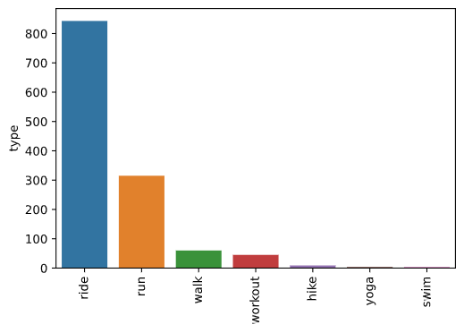

# Workouts Classifier: Project Overview 
* Built a model that accurately predicts what type of workout (ride, run, hike, etc.) I have completed. 
* Extracted 1280 workouts and their accompanying data using the Strava API.
* Cleaned messy data and Interpolated missing data
* Optimized Logistic Regression, Random Forrest, and XGBoost Classifers to reach the best model. 

## Code and Resources Used 
- Python Version: 3.8.5  
- Packages: pandas, numpy, stravalib, sklearn, matplotlib, seaborn, altair
- Inspiration: https://github.com/PlayingNumbers/ds_salary_proj

## Data Collection
Using the stravalib library and the Strava API I extracted 1280 of my strava activities. With each activity, we got the following:
* type
* date
* moving_time
* activity_id
* name
* distance
* elevation gain
* trainer
* average_speed
* max_speed
* average_watts
* suffer_score
* average_heartrate
* average_cadence
* kilojoules
* gear_id
* average_temp
* start_longitude
* start_latitude
* timezone
* location_city
* location_state
* location_country

## Data Cleaning
After extracting the data, I needed to clean it up so that it was usable for our model. I made the following changes and created the following variables:

*	Checked all columns for missing values 
*	Filled in any missing values for average_heartrate, kilojoules, suffer_score, and average temp with the average of those columns
*	Changed any blank values for average_cadence and average_watts to 0.
*	Feature engineered various new features sorrounding dates (year, month, day of the week etc.)
*	Removed workout types I wasn't interested in classifying 

## EDA
I looked at the distributions of the data and the value counts for the various categorical variables. Below are a few highlights from the pivot tables. 

## Model Building 

First, I transformed the categorical variables into dummy variables. I also split the data into train and tests sets with a test size of 20%.   

I tried three different models and evaluated them using accuracy as my primary metric but also looking into recall and f1-score

I tried three different models:
*	**Logistic Regression** – Baseline for the model
*	**Random Forest** – Because of the sparse data from the many categorical variables, I thought a Random Forest would be effective.
*	**XGBoost** – Given XGboost typically out performs other algorithms, I thought that this would be a good fit. 

## Model performance
The XGBoost model far outperformed the other approaches on the test and validation sets. 
*	**Logistic Regression** : Accuracy = 92.97% 
*	**Random Forest**: Accuracy = 98.44%
*	**XGBoost**: Accuracy = 100%

